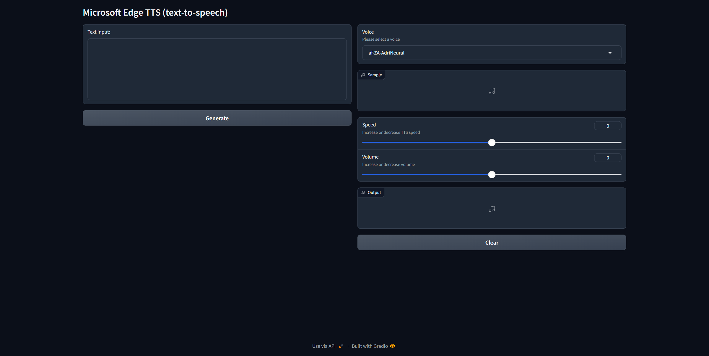

> [!NOTE]  
> Forked from [ycyy/edge-tts-webui](https://github.com/ycyy/edge-tts-webui), translated to English, and added support for all available languages from [edge-tts](https://github.com/rany2/edge-tts).

---

`edge-tts-webui` is the web interface version of [edge-tts](https://github.com/rany2/edge-tts) developed with `gradio`.



## Installation

To avoid conflicts with other Python packages, it's **recommended** to create a virtual environment:

1. Clone the repository:

    ```bash
    git clone https://github.com/kryef/edge-tts-webui.git
    cd edge-tts-webui
    ```

2. Create a virtual environment:

    ```bash
    python -m venv venv
    ```

3. Activate the virtual environment:

    - On Windows:

        ```bash
        venv\Scripts\activate
        ```

    - On macOS and Linux:

        ```bash
        source venv/bin/activate
        ```

4. Install the required packages:

    ```bash
    pip install -r requirements.txt
    ```

## Running

To start the application, run:

```bash
python src/app.py
```

## Usage

Launch your favorite web browser and go to:

```
http://127.0.0.1:7860/
```

---
